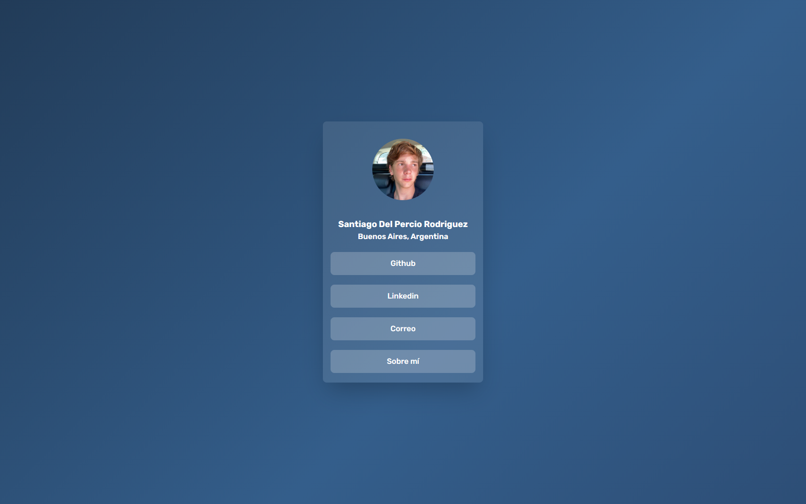

# Tarjeta de Contacto Personal

## Descripción
Este proyecto es una **tarjeta de contacto personal** diseñada como mi primer proyecto utilizando **Tailwind CSS**. La página incluye una breve sección "Sobre mí" y enlaces a mis perfiles.

## Funcionalidades
- **Diseño responsivo**: Adaptado para dispositivos móviles y de escritorio.
- **Acordeón interactivo**: Muestra información al hacer clic.
- **Links funcionales**: Acceso directo a mis perfiles de GitHub y LinkedIn.

## Tecnologías utilizadas
- **HTML**: Estructura básica.
- **CSS con Tailwind**: Estilización rápida y moderna.
- **JavaScript**: Manejo de la interactividad.

## Captura del proyecto

## Cómo verlo
La tarjeta está disponible online:  
[Link](https://santiagodelpercior.github.io/contacto/)

